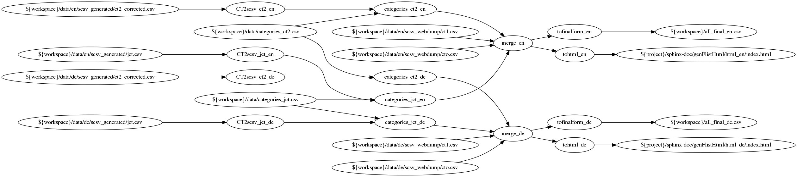

# Steps Config and Data

Single steps can be run in isolation by providing the `./src/flistapp.py` with arguments that are step names. When omitted, the "defaultsteps" configuration from './config.yaml' is used.

Since each step receives its input from the workspace directory, and writes its output to the workspace also, that directory can be seen as the "state" of the program.

At the end of this document, the YAML file is listed which embodies i.a. the following graph and the information flow discussed in the following. In the following graph, input files that are not both input and output are shown, as well as the intermediate steps processing them. The config argument names are omitted for better cleanness. The tohtml step is omitted for now.

<!--  -->


It is however best viewed in a new Tab via right click -> open image in new tab.

## Steps

The steps are implemented by their eponymous `step_{name}.py` files in `./src`

- **CT2scsv_{ct2,jct}_{en,de}** (4 separate steps): processes the files that JCT and CT2 generate, into regular columnar CSV. Generates ids that are consistent across languages based on symmetry between english and german files.
  - id_reference: the csv file that is used to create functionality entry IDs (for bridging languages)
  - input       : the input path, output format of JCT/CT2 file (see below, "Data Formats")
  - output      : the output path: SCSV file (see below, "Data Formats")

- **step.categories_{ct2,jct}_{en,de}**: Assigns categories to SCSV files from JCT and CT2, based on script-extracted and used-feedback input.
  input  : SCSV file (see below, "Data Formats")
  catfile: the "trunk" CSV file that maps ids to categories. Two columns: "id" and "category". The category column must contain the english category string.
  feedbackfile: A file where the program writes entries that have yet to receive a category from user input. Possible interaction by the user with this file will be taken into account in the next run of the program.
  output : SCSV file (see below, "Data Formats")

- **step.merge_{en,de}**: Merges SCSV files into a single MCSV file, compounding by identical "functionality" column.
  input: 
    - list
    - of
    - SCSV
    - files (see below, "Data Formats")
  output: MCSV file (see below, "Data Formats")

- **step.tofinalform_en**: Converts merged MCSV files into the form the database expects
  input: MCSV file (see below, "Data Formats")
  output: SQL-Database-fitting CSV (see below, "Data Formats")

- **step.tohtml**: Converts merged MCSV files into a html page that is supposed to be the same as the eventual result on the cryptool.org home page
  input: MCSV file (see below, "Data Formats")
  output: html page in the `./sphinx-doc` directory

## Data Formats

### Output of JCT and CT2

Example:

```
[...]
Known plaintext;W;
;[W];Cryptanalysis\ Modern Encryption\ Symmetric Encryption\ AES\ Known plaintext
;[W];Cryptanalysis\ Modern Encryption\ Symmetric Encryption\ DES\ Known plaintext
;[W];Cryptanalysis\ Modern Encryption\ Symmetric Encryption\ SDES\ Known plaintext

Prime Factorization;W;
;[W];Mathematical Functions\ Prime Factorization
[...]
```

English and German versions have to by symmetrical -- each line has to have the exact translated correspondence in the other file.

Following an empty line is the "Functionality group", followed by a semicolon, followed by a string that has to be there for legacy reasons, followed by a final semicolon. 
Then, without newlines, follow functionality addresses within the tool. Such a line has to start with a semicolon. Then, a single character in brackets indicates one of possibly many ways a tool offers functionalities. After another semicolon, backslash- or slash-separated path elements indicate a path the user has to follow (e.g. with mouse clicks in a menu) to reach the functionality.


### SCSV

- 5 columns, separated by semicolon. 
    - id
    - functionality group / name
    - how implemented: "[tool name]:[character]"
        - e.g. CT1:X (X for the single "how implemented category" that CT1 has), e.g. JCT:A (for the algorithm perspective of JCT)
    - path: slash- or backslash-separated path for the user to follow to reach the functionality
    - category: one of a fixed set of categories that the website uses to divide up the functionalities, spanning tools (see `./data/categories.csv`).
- Example of a single line: `CT1:en:static:1;3DES;CT1:X;CT1:X\ Encrypt/Decrypt\ Symmetric (modern)\ Triple DES…;2) Modern Ciphers`
- A "header row" (first line in a file with column names) is not specially recognized and must be avoided.

### MCSV

same columns and format as SCSV, except for:
    - in the "path" column, multiple paths can exist, separated by newline html characters
    - multiple "id"s can be in the "id" column, separated by "+"
    - multiple how_implemented elements can be in the "how_implemented" column, separated by a backslash

Simply put, an MCSV entry represents the union of multiple SCSV entries.

### SQL-Database-fitting CSV

A format that directly corresponds to the columns of the database in the JOOMLA domain of the cryptool.org website. These columns are:

- Id
- Category
- Functionality
- CrypTool 1 how_implemented
- CrypTool 2 how_implemented
- JCrypTool how_implemented
- CrypTool-Online how_implemented
- Path in CT1
- Path in CT2
- Path in JCT
- Path in CTO

## Appendix: YAML file

``` yaml

# This is a YAML file -- see Wikipedia for more detailed syntax.
# configuration lines can be disabled by prefixing them with a '#'
# "defaultsteps" is the sequence of steps that is run when the program is launched without any arguments.
# If the program is launched with string arguments, they are assumend to be single step names which are run in turn.

# There are a few placeholders that get resolved in file paths:
# - {project} is resolved to the directory of this config file.
# - {workspace} is resolved to the main workspace, {project}/ws (TODO: make configurable)
# - {workspace_template} is resolved to the workspace template directory, {project}/ws-static (TODO: make configurable)

# available steps are:
# - init_workspace
# -  CT2scsv_ct2_en
# -  CT2scsv_ct2_de
# -  CT2scsv_jct_en
# -  CT2scsv_jct_de
# -  categories_ct2_de
# -  categories_ct2_en
# -  categories_jct_de
# -  categories_jct_en
# -  merge_en
# -  merge_de
# -  tofinalform_en
# -  tofinalform_de
# -  tohtml_en
# -  tohtml_de

# This setting specifies the folder name of the main workspace. 

defaultsteps:
  # - init_workspace # activate this if you want to re-create the workspace. Caution: overwrites ALL workspace files!
  - CT2scsv_ct2_en
  - CT2scsv_ct2_de
  - CT2scsv_jct_en
  - CT2scsv_jct_de
  - categories_ct2_de
  - categories_ct2_en
  - categories_jct_de
  - categories_jct_en
  - merge_en
  - merge_de
  - tofinalform_en
  - tofinalform_de
  - tohtml_en
  - tohtml_de

step.CT2scsv_ct2_en:
  id_reference: ${workspace}/data/en/scsv_generated/ct2_corrected.csv
  input       : ${workspace}/data/en/scsv_generated/ct2_corrected.csv
  output      : ${workspace}/scsv_ct2_nocat_en.csv

step.CT2scsv_ct2_de:
  id_reference: ${workspace}/data/en/scsv_generated/ct2_corrected.csv
  input       : ${workspace}/data/de/scsv_generated/ct2_corrected.csv
  output      : ${workspace}/scsv_ct2_nocat_de.csv

step.CT2scsv_jct_en:
  id_reference: ${workspace}/data/en/scsv_generated/jct.csv
  input       : ${workspace}/data/en/scsv_generated/jct.csv
  output      : ${workspace}/scsv_jct_nocat_en.csv

step.CT2scsv_jct_de:
  id_reference: ${workspace}/data/en/scsv_generated/jct.csv
  input       : ${workspace}/data/de/scsv_generated/jct.csv
  output      : ${workspace}/scsv_jct_nocat_de.csv


step.categories_ct2_en:
  input  : ${workspace}/scsv_ct2_nocat_en.csv
  catfile: ${workspace}/data/categories_ct2.csv
  feedbackfile: ${workspace}/data/categories_interaction_required_ct2.csv
  output : ${workspace}/scsv_ct2_en.csv

step.categories_ct2_de:
  input  : ${workspace}/scsv_ct2_nocat_de.csv
  catfile: ${workspace}/data/categories_ct2.csv
  feedbackfile: ${workspace}/data/categories_interaction_required_ct2.csv
  output : ${workspace}/scsv_ct2_de.csv

step.categories_jct_en:
  input  : ${workspace}/scsv_jct_nocat_en.csv
  catfile: ${workspace}/data/categories_jct.csv
  feedbackfile: ${workspace}/data/categories_interaction_required_jct.csv
  output : ${workspace}/scsv_jct_en.csv

step.categories_jct_de:
  input: ${workspace}/scsv_jct_nocat_de.csv
  catfile: ${workspace}/data/categories_jct.csv
  feedbackfile: ${workspace}/data/categories_interaction_required_jct.csv
  output: ${workspace}/scsv_jct_de.csv

step.merge_en:
  input: 
    - ${workspace}/data/en/scsv_webdump/ct1.csv
    - ${workspace}/data/en/scsv_webdump/cto.csv
    - ${workspace}/scsv_ct2_en.csv
    - ${workspace}/scsv_jct_en.csv
  output: ${workspace}/all_merged_en.csv

step.merge_de:
  input: 
    - ${workspace}/data/de/scsv_webdump/ct1.csv
    - ${workspace}/data/de/scsv_webdump/cto.csv
    - ${workspace}/scsv_ct2_de.csv
    - ${workspace}/scsv_jct_de.csv
  output: ${workspace}/all_merged_de.csv

step.tofinalform_en:
  input: ${workspace}/all_merged_en.csv
  output: ${workspace}/all_final_en.csv

step.tofinalform_de:
  input: ${workspace}/all_merged_de.csv
  output: ${workspace}/all_final_de.csv

step.tohtml_en:
  template_html: ${workspace}/data/en/html_template
  input: ${workspace}/all_final_en.csv
  output: ${project}/sphinx-doc/genFlistHtml/html_en/index.html

step.tohtml_de:
  template_html: ${workspace}/data/de/html_template
  input: ${workspace}/all_final_de.csv
  output: ${project}/sphinx-doc/genFlistHtml/html_de/index.html

```
